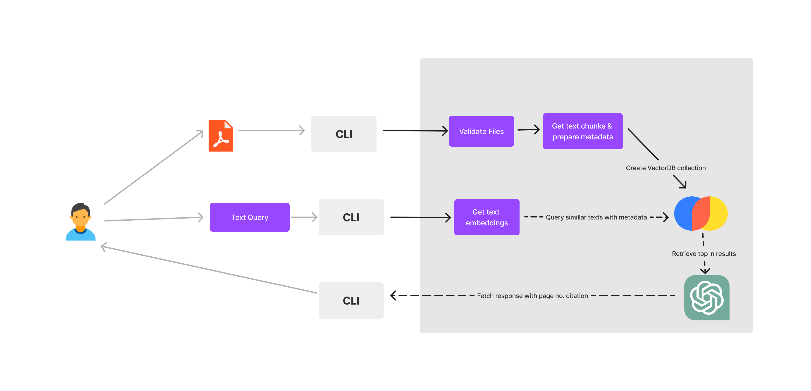

# pdf-cli-chatbot

Interact with any PDF file from the terminal without using Langchain or LlamaIndex. 
At times you do not need frameworks like Langchain, this is a demo of how you can build a simple CLI chatbot without relying on LLM frameworks.

# Tech stack
1. Python Argparse for CLI
2. ChromaDB as vector database
3. OpenAI chatgpt turbo 3.5

# Read the article
https://www.analyticsvidhya.com/blog/2023/09/how-to-build-a-pdf-chatbot-without-langchain/

# Workflow

